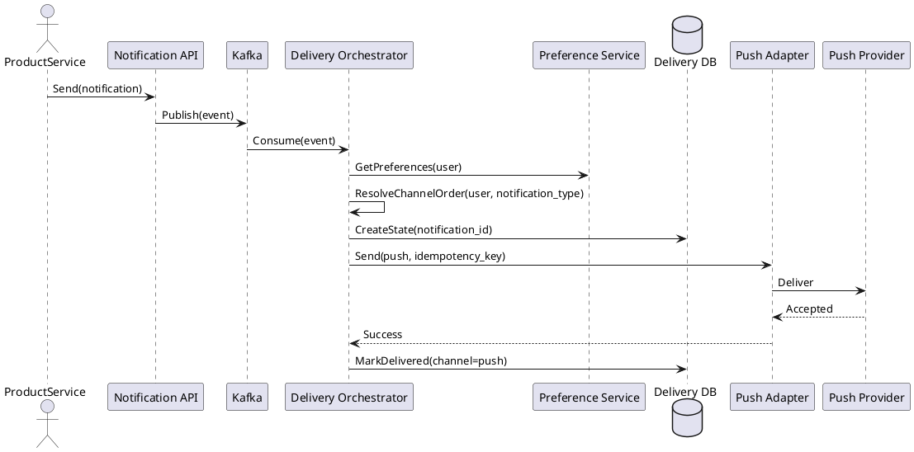
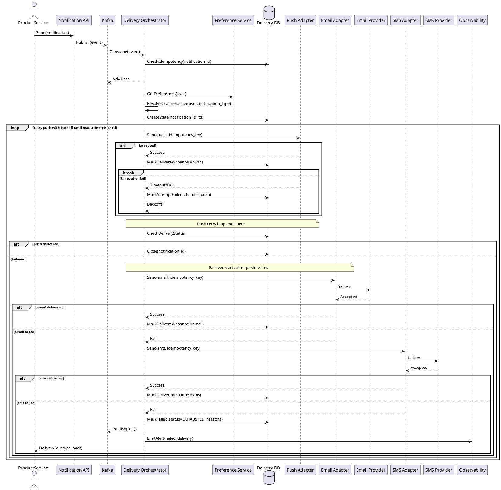
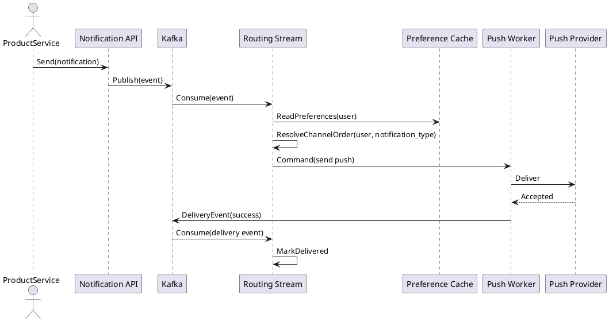
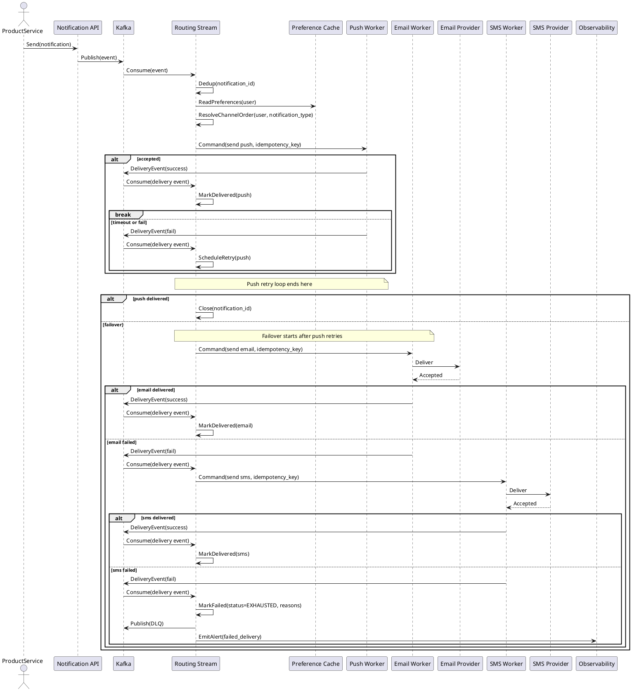

# Домашнее задание №4. Требования и архитектурное мышление

## Оглавление

1. [Часть 1-7. Требования и архитектурное мышление](#часть-1-7-требования-и-архитектурное-мышление)
2. [RFC: Гарантированная доставка критичных уведомлений с кросс-канальным failover](#rfc-гарантированная-доставка-критичных-уведомлений-с-кросс-канальным-failover)

## Часть 1-7. Требования и архитектурное мышление

### 1. Функциональные требования

| № | Приоритет | Обозначение | Требование |
|---|-----------|-------------|------------|
| 1 | MUST HAVE | FR1 | Система принимает уведомления от продуктовых сервисов единым контрактом и маршрутизирует их по типам (транзакционные, сервисные, маркетинговые) |
| 2 | MUST HAVE | FR2 | Система обеспечивает доставку транзакционного уведомления хотя бы по одному каналу либо фиксирует исчерпание всех допустимых попыток доставки |
| 3 | MUST HAVE | FR3 | Пользователь может настраивать предпочтительный канал и отключать маркетинговые и сервисные уведомления, транзакционные отключить нельзя |
| 4 | SHOULD HAVE | FR4 | Система поддерживает массовые кампании на аудиторию до 1 млн пользователей и позволяет запускать их без деградации транзакционных уведомлений |
| 5 | MUST HAVE | FR5 | Система предотвращает дублирование уведомлений при повторных запросах и при failover между каналами |
| 6 | SHOULD HAVE | FR6 | Система предоставляет продуктовым командам и службе поддержки историю отправок и статусы доставки |
| 7 | MUST HAVE | FR7 | Система автоматически переключает транзакционное уведомление на резервный канал после исчерпания политики retry основного канала или при явном отказе основного канала |
| 8 | MUST HAVE | FR8 | Система обрабатывает транзакционные уведомления с приоритетом выше сервисных и маркетинговых |
| 9 | MUST HAVE | FR9 | Система выполняет повторные попытки отправки критичных уведомлений до успешной доставки или истечения TTL |
| 10 | SHOULD HAVE | FR10 | Система применяет ограничения частоты для маркетинговых уведомлений, не чаще 7 в сутки на пользователя |
| 11 | COULD HAVE | FR11 | Система поддерживает тихие часы для сервисных и маркетинговых уведомлений |
| 12 | COULD HAVE | FR12 | Система поддерживает локализацию шаблонов уведомлений по языку пользователя |

### 2. Нефункциональные требования

| № | Приоритет | Обозначение | Требование |
|---|-----------|-------------|------------|
| 1 | MUST HAVE | NFR1 | Задержка транзакционных уведомлений: p99 <= 2 с от события до принятия уведомления провайдером, p95 <= 30 с до фактической доставки хотя бы по одному каналу |
| 2 | MUST HAVE | NFR2 | Гарантия доставки критичных: успешная доставка >= 99.95% транзакционных уведомлений в течение 5 минут |
| 3 | MUST HAVE | NFR3 | Масштабируемость: устойчиво обрабатывает 5 000 уведомлений/с в пике и отдельные кампании 1 млн уведомлений за 15 минут |
| 4 | MUST HAVE | NFR4 | Доступность платформы: 99.95% в месяц для API приема уведомлений и маршрутизации |
| 5 | SHOULD HAVE | NFR5 | Для не менее 99% уведомлений доступна сквозная трассировка пути от приема до финального статуса доставки, метрики и алерты обновляются не реже одного раза в минуту |
| 6 | SHOULD HAVE | NFR6 | Актуальность настроек пользователя: изменения предпочтений применяются <= 60 с |
| 7 | MUST HAVE | NFR7 | После аварии система восстанавливается не более чем за 30 минут, и при этом теряет не более 5 минут данных о состоянии доставки |
| 8 | SHOULD HAVE | NFR8 | История доставки и статусы хранятся не менее 12 месяцев |
| 9 | MUST HAVE | NFR9 | Неавторизованный доступ к данным доставки недопустим, доступ предоставляется только аутентифицированным пользователям и сервисам в соответствии с ролевой моделью |

Расчет нагрузок (порядок величин):
- Платформа: 3 000 000 DAU * 10 уведомлений/день = 30 000 000 уведомлений/день.
- Средняя скорость: 30 000 000 / 86 400 ~= 347 уведомлений/с.
- Транзакционные: 3 000 000 DAU * 2/день = 6 000 000/день ~= 69 уведомлений/с.
- Массовые кампании: 1 000 000 / 900 с ~= 1 111 уведомлений/с (15 минут).
- Пик платформы с учетом коэффициента 10x: 3 500-5 000 уведомлений/с.

### 3. Архитектурно значимые требования (ASR)

1. ASR-1: Низкая задержка транзакционных уведомлений.
   - Связанные требования: NFR1, FR2, FR8.
   - Почему влияет: требует минимизации синхронных операций, отдельного приоритезационного пути и низкой латентности брокера.

2. ASR-2: Гарантированная доставка с failover без дублей.
   - Связанные требования: NFR2, FR2, FR5, FR7, FR9.
   - Почему влияет: нужна надежная модель состояния, идемпотентность, ретраи, дедупликация и контроль статуса.

3. ASR-3: Высокая пропускная способность при массовых кампаниях.
   - Связанные требования: NFR3, FR4, FR8.
   - Почему влияет: требуется асинхронная обработка, очереди, шардирование и изоляция потоков.

4. ASR-4: Восстановление оперативного состояния доставки и долговременное хранение истории доставки.
   - Связанные требования: NFR7, NFR8, FR6.
   - Почему влияет: требует репликации, резервного копирования и стратегии архивации без потери доступности.

5. ASR-5: Защита данных доставки и строгий контроль доступа.
   - Связанные требования: NFR9, FR6.
   - Почему влияет: влияет на выбор механизмов авторизации, аудита и шифрования.

### 4. Ключевые архитектурные вопросы

1. Как реализовать failover между каналами без дублирования?
   - Порождено ASR-2, FR5.
   - Важно, потому что ошибки здесь увеличат жалобы и стоимость, затраченную на SMS.

2. Как разделить приоритеты потоков (транзакционные vs кампании)?
   - Порождено ASR-1, ASR-3.
   - Важно, чтобы массовые отправки не ухудшали SLA транзакционных.

3. Где хранить и как обновлять состояние доставки?
   - Порождено ASR-2, ASR-4.
   - Важно для ретраев, консистентности и восстановления после сбоев.

4. Как обеспечить RTO/RPO и восстановление состояния доставки после аварии?
   - Порождено ASR-4, NFR7.
   - Важно, чтобы критичные уведомления не терялись и сервис быстро возвращался в рабочее состояние.

5. Как организовать хранение истории доставки на 12 месяцев без деградации производительности?
   - Порождено ASR-4, NFR8.
   - Важно для аудита и поддержки при больших объемах данных.

6. Как реализовать ролевой доступ и аудит действий с данными доставки?
   - Порождено ASR-5, NFR9.
   - Важно для соответствия безопасности и снижения регуляторных рисков.

### 5. Архитектурные последствия ASR

- ASR-1: приоритезация очередей, быстрый брокер, отдельный пул воркеров, минимизация синхронных вызовов.
- ASR-2: модель состояния доставки, идемпотентные ключи, дедупликация, ретраи с backoff, хранение статусов.
- ASR-3: горизонтальное масштабирование, партиционирование по пользователю/каналу, изоляция потоков, батчинг кампаний.
- ASR-4: репликация и резервное копирование оперативного состояния, стратегия архивирования истории доставки и разделение горячего и холодного хранения.
- ASR-5: ролевой доступ, аудит операций, шифрование данных в покое и при передаче.

### 6. Решения, которые не подходят

1. Прямые синхронные вызовы от продуктовых сервисов к провайдерам.
   - Нарушается ASR-1 и ASR-2.
   - Нет централизованного контроля и гарантии доставки, большие задержки и зависимость от сбоев провайдера.

2. Единый монолитный сервис с периодическим опросом БД для отправки уведомлений.
   - Нарушается ASR-1 и ASR-3.
   - Опросная модель увеличивает задержку доставки, затрудняет приоритезацию транзакционных уведомлений и ограничивает горизонтальное масштабирование при пиковых нагрузках.

### 7. Неопределенности и архитектурные риски

1. Фактическая надежность провайдеров SMS/email.
   - Как проверить: нагрузочные тесты, анализ исторических SLA, пилотный запуск.

2. Доступность подтверждений доставки для push-уведомлений.
   - Как проверить: провести эксперимент с провайдерами и узнать процент подтверждений.

3. Правовые ограничения на возможность отключения критичных уведомлений (иначе можно дать отключить то, что по закону должно быть доставлено).
   - Как проверить: консультация с юристами.

---

# RFC: Гарантированная доставка критичных уведомлений с кросс-канальным failover

| Метаданные | Значение |
|------------|----------|
| Статус | DRAFT |
| Автор(ы) | Aydar |
| Ответственный | Aydar |
| Бизнес-заказчик | Head of Notifications |
| Ревьюеры | Lead Architect, 2026-04-07 |
| Дата создания | 2026-04-07 |
| Дата обновления | 2026-04-07 |

---

## Оглавление

1. [Контекст](#контекст)
2. [Продуктовый анализ](#продуктовый-анализ)
3. [Пользовательские сценарии](#пользовательские-сценарии)
4. [Статистика](#статистика)
5. [Требования](#требования)
6. [Варианты решения](#варианты-решения)
7. [Сравнительный анализ](#сравнительный-анализ)
8. [Выводы](#выводы)
9. [Связанные задачи](#связанные-задачи)

---

## Контекст

> Цель раздела: описать проблему или возможность, которую решает данное предложение.

Система уведомлений должна гарантировать доставку критичных транзакционных уведомлений при отказах каналов, соблюдая требования на задержку, минимизируя стоимость и предотвращая дублирование. Внешние провайдеры нестабильны, поэтому требуются автоматический failover и точное управление состоянием доставки.
RFC описывает архитектуру подсистемы гарантированной доставки критичных транзакционных уведомлений как части общей Notification Platform. Требования к маркетинговым и сервисным уведомлениям, тихим часам, локализации и частотным ограничениям в данном RFC не детализируются.

### Ключевые вопросы
- Как гарантировать доставку хотя бы через один канал при сбоях провайдеров?
- Как избежать дублей при повторных отправках и переключении каналов?
- Как удержать низкую задержку для транзакционных уведомлений?

В рамках данного RFC успешной доставкой считается подтвержденное принятие уведомления внешним провайдером, а для каналов c подтверждением доставки - получение такого подтверждения.

---

## Продуктовый анализ

Ценность для бизнеса: снижение жалоб, снижение оттока и повышение удержания пользователей, соблюдение безопасности операций. Самое важное для пользователя — уведомление о критичной транзакции приходит быстро и надежно, даже если часть каналов недоступна.

---

## Пользовательские сценарии

> Цель раздела: описать как пользователи будут взаимодействовать с системой.

| Приоритет | Тип сценария | Действующее лицо | Сценарий |
|-----------|--------------|------------------|----------|
| MUST HAVE | Транзакционный | Пользователь | Получает уведомление о списании средств <= 30 с, даже при сбое push | 
| MUST HAVE | Транзакционный | Пользователь | Получает подтверждение перевода через резервный канал при недоступности основного | 
| SHOULD HAVE | Настройки | Пользователь | Выбирает предпочтительный канал для критичных уведомлений | 
| SHOULD HAVE | Поддержка | Сотрудник поддержки | Видит историю доставки и причины failover | 
| COULD HAVE | Антиспам | Пользователь | Не получает дубли при повторной отправке | 

---

## Статистика

- MAU: 10 млн, DAU: 3 млн, Peak Concurrent Users: 300 000.
- Среднее: 10 уведомлений/пользователь/день.
- Транзакционные: 6 млн/день ~= 69/с (среднее).
- Общая пиковая нагрузка платформы: 3 500-5 000 уведомлений/с.
- Целевая проектная пиковая нагрузка подсистемы критичных транзакционных уведомлений: до 1 000 уведомлений/с.

---

## Требования

В работе используются два уровня требований. FR и NFR описывают требования ко всей Notification Platform в целом. RFR и RNFR вводятся на уровне RFC и уточняют требования к конкретной подсистеме.

### Функциональные требования

| № | Приоритет | Обозначение | Требование |
|---|-----------|-------------|------------|
| 1 | MUST HAVE | RFR1 | Система должна обеспечить попытки доставки критичного уведомления по приоритетным и резервным каналам до успешной доставки хотя бы по одному каналу либо до исчерпания политики retry и TTL | 
| 2 | MUST HAVE | RFR2 | Автоматически переключать транзакционное уведомление на резервный канал после исчерпания retry основного канала или при явном отказе основного канала | 
| 3 | MUST HAVE | RFR3 | Учитывать пользовательский порядок предпочтений каналов | 
| 4 | MUST HAVE | RFR4 | Исключать дубли при ретраях и failover | 
| 5 | SHOULD HAVE | RFR5 | Минимизировать стоимость доставки, по возможности используя наиболее дешевый допустимый канал среди разрешенных политикой и пользовательскими предпочтениями | 
| 6 | SHOULD HAVE | RFR6 | Предоставлять аудит доставки и причины failover | 
| 7 | MUST HAVE | RFR7 | Идемпотентно обрабатывать повторные запросы по ключу уведомления | 
| 8 | SHOULD HAVE | RFR8 | Фиксировать выбранный канал и причину failover для каждого уведомления | 
| 9 | SHOULD HAVE | RFR9 | Повторять доставку критичного уведомления до 5 минут или до успешной доставки | 
| 10 | SHOULD HAVE | RFR10 | Возвращать статус доставки в продуктовые сервисы через callback или API | 
| 11 | MUST HAVE | RFR11 | При исчерпании попыток фиксировать финальный неуспех с причинами, помещать событие в DLQ и поднимать алерт | 

### Нефункциональные требования

| № | Приоритет | Обозначение | Требование |
|---|-----------|-------------|------------|
| 1 | MUST HAVE | RNFR1 | p99 <= 2 с до принятия провайдером для транзакционных | 
| 2 | MUST HAVE | RNFR2 | Успешная доставка >= 99.95% за 5 минут | 
| 3 | MUST HAVE | RNFR3 | Обработка >= 1 000 транзакционных уведомлений/с в пике | 
| 4 | MUST HAVE | RNFR4 | 99.95% доступности подсистемы доставки | 
| 5 | SHOULD HAVE | RNFR5 | Для не менее 99% уведомлений доступна полная трассировка пути доставки | 
| 6 | SHOULD HAVE | RNFR6 | Стоимость доставки транзакционных: средняя <= 1 SMS на 10 уведомлений | 
| 7 | MUST HAVE | RNFR7 | RTO <= 30 минут, RPO <= 5 минут для состояния доставки | 
| 8 | SHOULD HAVE | RNFR8 | История доставок хранится не менее 12 месяцев | 
| 9 | SHOULD HAVE | RNFR9 | Время детектирования отказа канала и запуска failover <= 10 с | 
| 10 | SHOULD HAVE | RNFR10 | Очередь транзакционных уведомлений не блокируется отказом провайдера более 30 с | 

ASR для этой подсистемы:
- ASR-1 (низкая задержка), ASR-2 (гарантированная доставка с failover), ASR-3 (высокая пропускная способность), ASR-4 (восстановление и история), ASR-5 (безопасность и доступ).

Расчет нагрузок:
```
Платформа: 3 000 000 DAU * 10 уведомлений/день = 30 000 000 уведомлений/день
Средняя скорость: 30 000 000 / 86 400 ~= 347 уведомлений/с
Транзакционные: 3 000 000 DAU * 2/день = 6 000 000/день ~= 69 уведомлений/с
Общий пик платформы: 3 500-5 000 уведомлений/с
Подсистема критичных транзакционных: проектный пик до 1 000 уведомлений/с (с запасом)
```

---

## Варианты решения

### Вариант 1: Stateful Orchestrator

> Описание: центральный оркестратор управляет состоянием доставки, порядком каналов и ретраями. Состояние хранится в БД, отправки идут через адаптеры каналов.

#### Архитектура (C4 Container)

```plantuml
@startuml
!define C4P https://raw.githubusercontent.com/plantuml-stdlib/C4-PlantUML/master
!includeurl C4P/C4_Container.puml

Person(user, "Пользователь")
System_Ext(product, "Product Service", "External")
System_Boundary(s1, "Notification Platform") {
  Container(api, "Notification API", "HTTP", "Прием событий от продуктовых сервисов")
  Container(kafka, "Kafka", "Broker", "Очереди по типам и приоритетам")
  Container(orch, "Delivery Orchestrator", "Service", "Состояние, правила, failover")
  Container(pref, "Preference Service", "Service", "Настройки и приоритеты каналов")
  Container(db, "Delivery State DB", "PostgreSQL", "Статусы, дедуп, ретраи")
   Container(push, "Push Adapter", "Service", "Отправка в push провайдер")
   Container(email, "Email Adapter", "Service", "Отправка в email провайдер")
   Container(sms, "SMS Adapter", "Service", "Отправка в SMS провайдер")
   Container(obs, "Observability", "OTel + Prometheus", "Метрики, логи, трейсинг")
   Container(auth, "Access Control", "Service", "Authorization and policy checks")
   Container(audit, "Audit Log", "Service", "Immutable audit trail")
   Container(archive, "Archive Storage", "Object Storage", "Long-term delivery history")
   Container(kms, "Key Management", "Service", "Encryption key management")
}

System_Ext(pushp, "Push Provider", "External")
System_Ext(smsp, "SMS Provider", "External")
System_Ext(emailp, "Email Provider", "External")

Rel(product, api, "Send notifications")
Rel(api, kafka, "Публикует")
Rel(kafka, orch, "Передает события")
Rel(orch, kafka, "Publish DLQ")
Rel(orch, pref, "Читает настройки")
Rel(orch, db, "Читает/пишет состояние")
Rel(orch, push, "Команда отправки")
Rel(orch, email, "Команда отправки")
Rel(orch, sms, "Команда отправки")
Rel(orch, product, "Callback status")
Rel(orch, auth, "Authorize")
Rel(orch, audit, "Audit events")
Rel(orch, archive, "Archive history")
Rel(db, kms, "Keys")
Rel(push, pushp, "Send")
Rel(sms, smsp, "Send")
Rel(email, emailp, "Send")
Rel(orch, obs, "Метрики/трейсы")
Rel(push, obs, "Метрики/трейсы")
Rel(sms, obs, "Метрики/трейсы")
Rel(email, obs, "Метрики/трейсы")
Rel(user, pushp, "Получает")
Rel(user, smsp, "Получает")
Rel(user, emailp, "Получает")
@enduml
```

#### Sequence: основной сценарий



#### Sequence: failover



#### Этапы реализации

| Этап | Описание | Планируемый срок | Ресурсы | Риски |
|------|----------|------------------|---------|-------|
| 1 | Выделение ядра оркестратора, контракты событий, базовая отправка push | 4-5 недель | 3-4 инженера | Недооценка интеграций |
| 2 | Failover, дедупликация, аудит, интеграции SMS и email | 6-7 недель | 4-5 инженеров | Рост стоимости инфраструктуры |

#### Как выполняются ASR

- ASR-1: Kafka + отдельные топики для транзакций, оркестратор без синхронных цепочек, быстрый путь до провайдера.
- ASR-2: централизованное состояние, идемпотентные ключи, дедуп в БД, контролируемый failover.
- ASR-3: горизонтальное масштабирование воркеров оркестратора и адаптеров, партиционирование.
- ASR-4: репликация и резервное копирование состояния, архивирование истории доставки.
- ASR-5: ролевой доступ, аудит операций и шифрование данных доставки.

#### Конкретные технологии

- Брокер: Kafka.
- БД: PostgreSQL (partitioned) для состояния доставки и Redis для планирования таймеров retry/backoff.
- Observability: OpenTelemetry, Prometheus, Grafana, Loki.

#### Масштаб и нагрузка

- Пиковая обработка: до 1 000 транзакционных уведомлений/с.
- Оркестратор: 20-40 воркеров (по 50-100 msg/с).
- SMS адаптер: rate limit и батчи по провайдеру.

#### Преимущества

- Прозрачная модель состояния и логика failover в одном месте.
- Простой аудит и дедупликация.

#### Недостатки

- Оркестратор становится ключевым узлом, требует масштабирования и HA.
- Более сложное хранение состояния и миграции БД.

---

### Вариант 2: Stream-driven Workflow

> Описание: логика маршрутизации и failover реализована как потоковая машина состояний в Kafka Streams. Канальные отправки выполняются отдельными воркерами, состояние хранится в state store. Routing Stream использует предварительно синхронизированный кэш пользовательских предпочтений, обновляемый из отдельного preference-сервиса.

#### Архитектура (C4 Container)

```plantuml
@startuml
!define C4P https://raw.githubusercontent.com/plantuml-stdlib/C4-PlantUML/master
!includeurl C4P/C4_Container.puml

System_Boundary(s1, "Notification Platform") {
  Container(api, "Notification API", "HTTP", "Прием событий")
  Container(kafka, "Kafka", "Broker", "Событийная шина")
  Container(stream, "Routing Stream", "Kafka Streams", "Машина состояний")
  Container(state, "State Store", "RocksDB", "Состояние доставки")
   Container(push, "Push Worker", "Service", "Отправка push")
   Container(email, "Email Worker", "Service", "Отправка email")
   Container(sms, "SMS Worker", "Service", "Отправка SMS")
   Container(prefsvc, "Preference Service", "Service", "Источник пользовательских настроек")
   Container(pref, "Preference Cache", "Redis", "Кэш настроек")
   Container(obs, "Observability", "OTel + Prometheus", "Метрики и трейсы")
   Container(auth, "Access Control", "Service", "Authorization and policy checks")
   Container(audit, "Audit Log", "Service", "Immutable audit trail")
   Container(archive, "Archive Storage", "Object Storage", "Long-term delivery history")
   Container(kms, "Key Management", "Service", "Encryption key management")
}

System_Ext(pushp, "Push Provider", "External")
System_Ext(smsp, "SMS Provider", "External")
System_Ext(emailp, "Email Provider", "External")
System_Ext(product, "Product Service", "External")

Rel(product, api, "Send notifications")
Rel(api, kafka, "Publish")
Rel(kafka, stream, "Events")
Rel(stream, kafka, "Publish delivery events/DLQ")
Rel(stream, state, "Read/Write")
Rel(stream, push, "Send command")
Rel(stream, email, "Send command")
Rel(stream, sms, "Send command")
Rel(stream, product, "Callback status")
Rel(prefsvc, pref, "Sync preferences")
Rel(stream, pref, "Read preferences")
Rel(stream, auth, "Authorize")
Rel(stream, audit, "Audit events")
Rel(stream, archive, "Archive history")
Rel(state, kms, "Keys")
Rel(push, pushp, "Send")
Rel(sms, smsp, "Send")
Rel(email, emailp, "Send")
Rel(stream, obs, "Metrics/Traces")
@enduml
```

#### Sequence: основной сценарий



#### Sequence: failover



#### Этапы реализации

| Этап | Описание | Планируемый срок | Ресурсы | Риски |
|------|----------|------------------|---------|-------|
| 1 | Построение stream state machine, базовые команды отправки | 5-6 недель | 4-5 инженеров | Сложность отладки state store |
| 2 | Failover, дедупликация, аудит, интеграции каналов | 7-8 недель | 5-6 инженеров | Повышенная операционная сложность |

#### Как выполняются ASR

- ASR-1: потоковая обработка близка к данным, минимум синхронных вызовов.
- ASR-2: состояние в state store, идемпотентность событий, детерминированные переходы.
- ASR-3: Kafka Streams масштабируется горизонтально по партициям.
- ASR-4: состояние восстанавливается из state store и логов, история архивируется отдельно.
- ASR-5: контроль доступа к состоянию и аудит операций на уровне сервисов и хранилища.

#### Конкретные технологии

- Брокер: Kafka.
- State store: RocksDB (Kafka Streams).
- Кэш настроек: Redis.
- Observability: OpenTelemetry, Prometheus, Grafana.

#### Масштаб и нагрузка

- Пиковая обработка: до 1 000 транзакционных уведомлений/с.
- Stream app: 10-30 инстансов в зависимости от партиций.

#### Преимущества

- Высокая масштабируемость, отсутствие центрального оркестратора.
- Естественная обработка событий и ретраев.

#### Недостатки

- Более сложная отладка и поддержка state store.
- Сложнее реализовать ручные операции и аудит.

---

## Сравнительный анализ

### Ресурсные требования

| Критерий | Вариант 1 | Вариант 2 |
|----------|-----------|-----------|
| Время реализации | 10-12 недель | 12-14 недель |
| Команда | 5-6 инженеров | 6-7 инженеров |
| Инфраструктура | БД + Kafka + Redis | Kafka + Streams + Redis |
| Организационные риски | Средние | Выше (операционная сложность) |

### Соответствие требованиям

| Требование | Вариант 1 | Вариант 2 |
|------------|-----------|-----------|
| RFR1 | ✅ Да | ✅ Да |
| RFR2 | ✅ Да | ✅ Да |
| RFR3 | ✅ Да | ✅ Да |
| RFR4 | ✅ Да | ✅ Да |
| RFR5 | ✅ Да | ✅ Да |
| RFR6 | ✅ Да | ✅ Да |
| RFR7 | ✅ Да | ✅ Да |
| RFR8 | ✅ Да | ✅ Да |
| RFR9 | ✅ Да | ✅ Да |
| RFR11 | ✅ Да | ✅ Да |
| RNFR1 | ✅ Да | ✅ Да |
| RNFR2 | ✅ Да | ✅ Да |
| RNFR3 | ✅ Да | ✅ Да |
| RNFR4 | ✅ Да | ✅ Да |
| RNFR5 | ✅ Да | ✅ Да |
| RNFR6 | ✅ Да | ✅ Да |
| RNFR7 | ✅ Да | ✅ Да |
| RNFR8 | ✅ Да | ✅ Да |
| RNFR9 | ✅ Да | ✅ Да |
| RNFR10 | ✅ Да | ✅ Да |

---

## Выводы

> Рекомендация: Вариант 1 (Stateful Orchestrator).

Обоснование выбора:
- Проще обеспечить аудит, дедупликацию и прозрачность статусов.
- Быстрее реализовать и сопровождать для команды без глубокого опыта потоковых state machine.
- Стоимость владения ниже при сопоставимой производительности.
- Вариант 1 лучше соответствует ASR-2 и ASR-4, поскольку централизованно управляет состоянием доставки, дедупликацией, failover и восстановлением.

Ключевые компромиссы: необходимость масштабировать оркестратор и поддерживать высокую доступность БД.

---

## Связанные задачи

Нет.

---

## Приложения

### Глоссарий

| Термин | Определение |
|--------|------------|
| Failover | Автоматическое переключение на резервный канал при сбое основного |
| Idempotency key | Ключ для предотвращения дублей при повторной отправке |
| Delivery state | Состояние доставки уведомления по каждому каналу |
| TTL | Время жизни уведомления или окна попыток доставки |
| Backoff | Увеличивающаяся пауза между повторными попытками отправки после ошибки |
| DLQ | Dead Letter Queue для сообщений, которые не удалось доставить |
